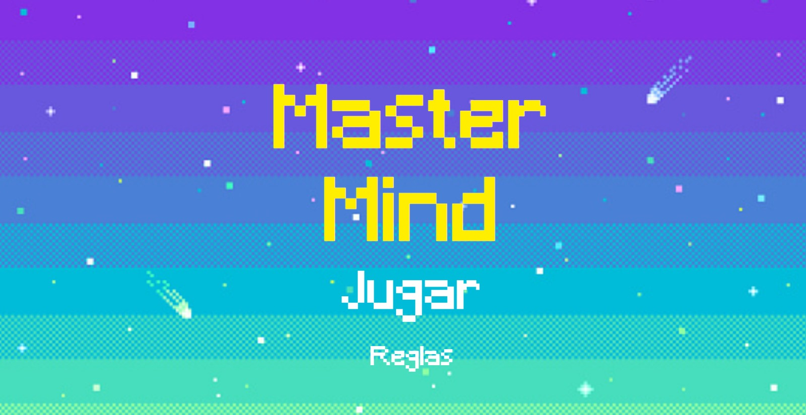
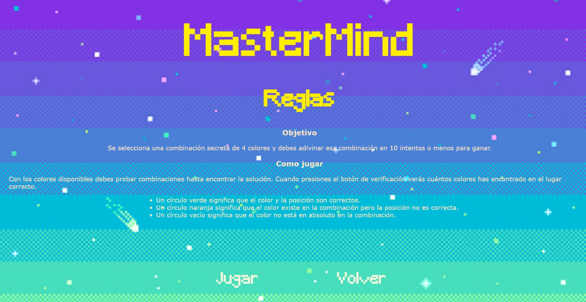
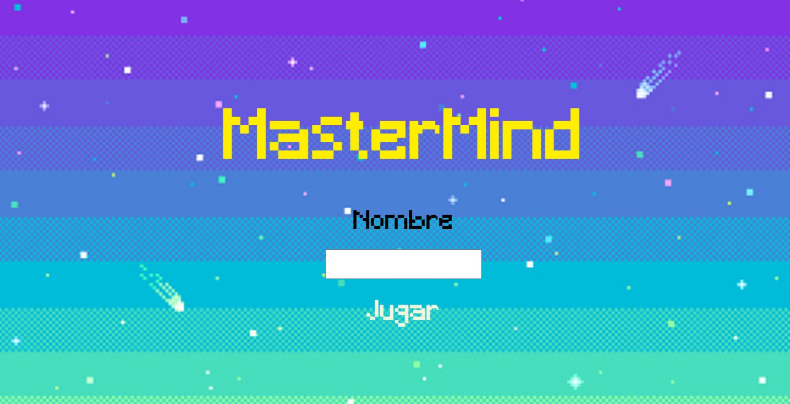
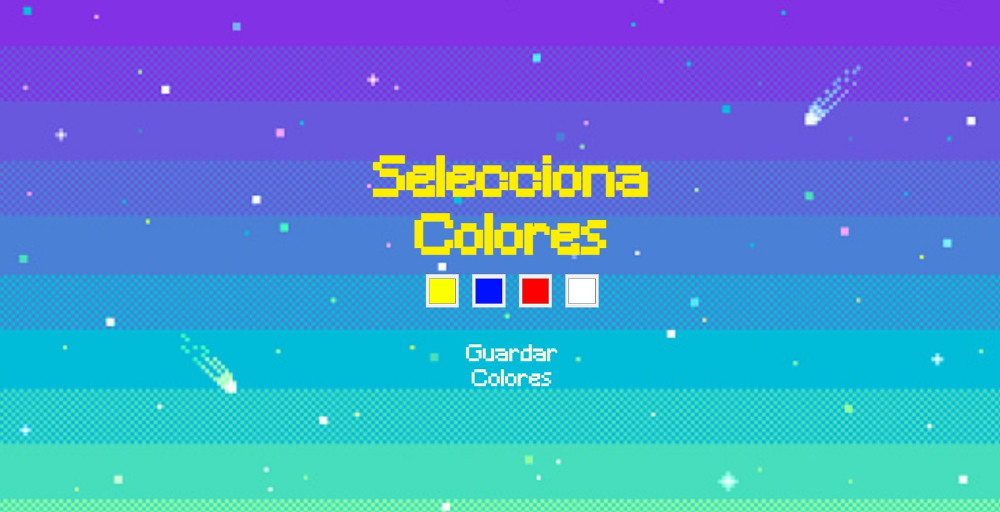
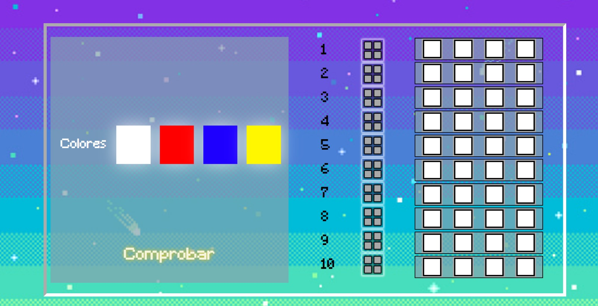
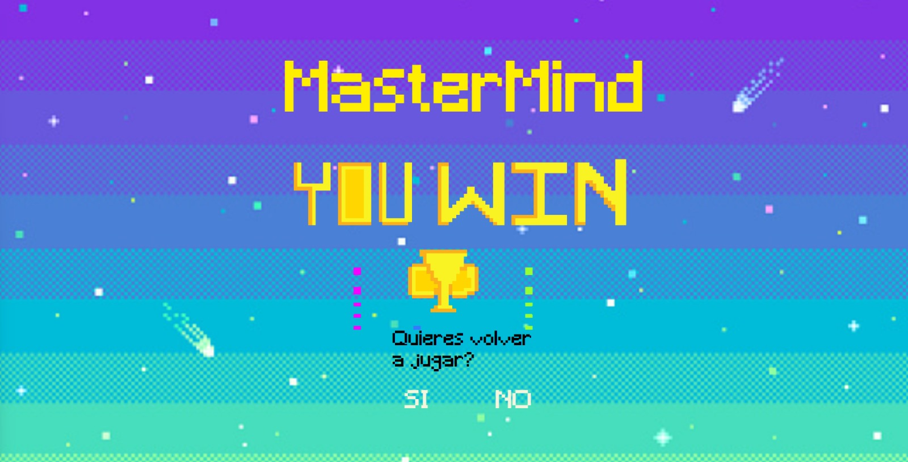
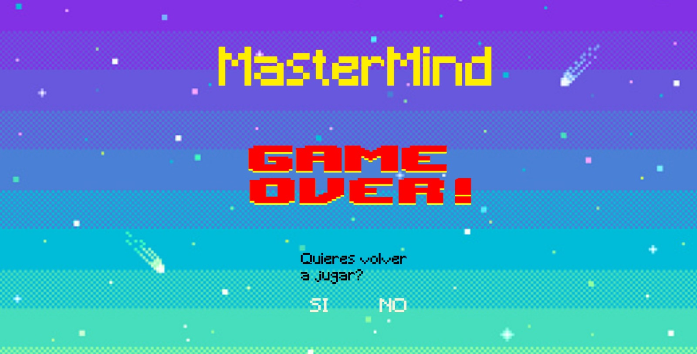

<h1 align="center">🤓MASTERMIND🤓</h1>
<h3 align="center"> PEDRO RONDÓN</h3>

<a href="https://pedrowolfr.github.io/MasterMind-PR/">https://pedrowolfr.github.io/MasterMind-PR/</a>

## Contenido

- [Introducción](#introducción)
- [Características](#📋-características)
- [Problemas y posibles soluciones ](#problemas-y-posibles-soluciones)
- [Tecnologías](#tecnologías-utilizadas)
- [Autor](#📝-autor)
- [Licencia](#⚖️-licencia)

## Introducción

**Mastermind**

**El Juego MasterMind** es un juego de mesa de estrategia que fue creado por Mordecai Meirowitz en 1970. El juego se ha convertido en un clásico y ha ganado popularidad en todo el mundo.
El objetivo es que el jugador descifre una combinación secreta de colores tratando de hacerlo con la menor cantidad de intentos.
Mastermind ha tenido varias ediciones y adaptaciones a lo largo de los años, pero la esencia del juego ha permanecido prácticamente inalterada. Su popularidad persiste, y sigue siendo apreciado como un juego de pensamiento lógico y estratégico.

## 📋 Características

Entrando a la pagina principal, nos encontraremos con la cara y bievenida al juego. Compuesto por el titulo y dos botones que te dirigen tanto a la seleccion de un nombre como a las reglas del juego respectivamente.

Al usar la opcion "Reglas" serán visibles las instrucciones de juego y nos permitira volver a la pantalla de inicio o pasar a escoger un nombre de usuario.

 

Si hacemos click en "Jugar" nos llevará a la pantalla donde se deberas escoger un nombre, el cual sera obligatorio para poder avanzar.

 

En la siguiente ventana, tendremos que elegir el nivel de dificultad, de momento solo estará disponible el nivel mas facil, siendo representado de manera peculiar, inspirado en los niveles de dificultad de un juego reconocido.

 

Una vez se ha definido el nombre y hayamos escogido nuestro nivel de dificultad, debemos decidirnos por 4 colores diferentes, dado que si no se eligen los 4 colores o si son iguales no nos permitira avanzar, arrojando una ventanilla de aviso al jugador.

Guardado los colores en el localstorage, se pasara a la pagina del juego donde tendremos en el lado izquierdo los colores que se han seleccionado previamente así como el boton "Comprobar" para verificar si la combinación de colores es correcta o no. 

En el lado derecho veremos reflejada la combinación de nuestro intento, el color verde indicara que el color esta en la ubicación correcta y el color blanco lo contrario. 

 

Si la combinación es correcta, avanzará a la pantalla ganadora y nos preguntará si queremos jugar nuevamente, en caso de que hagamos click en "Jugar de nuevo" nos pedirá que seleccionemos 4 nuevos colores.

 

Si en el decimo intento no hemos conseguido la combinación correcta de colores, nos llevará a la pantalla de perdedor, preguntandonos si queremos intentarlo nuevamente.

 

  
## Problemas y posibles soluciones 

En primera instancia tendria, que mejorar el responsive para poder ser jugado sin problemas en pantallas moviles.

Seguire trabajando por agregar los otros niveles de dificultad.

Agregar tambien un apartado donde se muestre el nombre del usuario y tiempo en resolver la combinacion.

Voy a continuar trabajando en las mejoras de este proyecto para perfeccionarlo.

## Tecnologías Utilizadas

 
## 📝 Autor

- **Nombre**: Pedro Rondón
- **Email**: pedro.rondonx@gmail.com
- **Linkedin**: [LinkedIn](https://www.linkedin.com/in/pedro-rond%C3%B3n-leon-1224ba168/)

## ⚖️ Licencia

Este proyecto está bajo la Licencia MIT. Consulta el archivo `LICENSE` para obtener más información.